# Отчёт по выполнению заданий

## Part 1. Установка ОС

Установка Ubuntu 20.04 Server LTS без графического интерфейса.
   - [x] Выполнить установку **Ubuntu 20.04 Server LTS** в **VirtualBox**
   - [x] Графический интерфейс должен отсутствовать.
   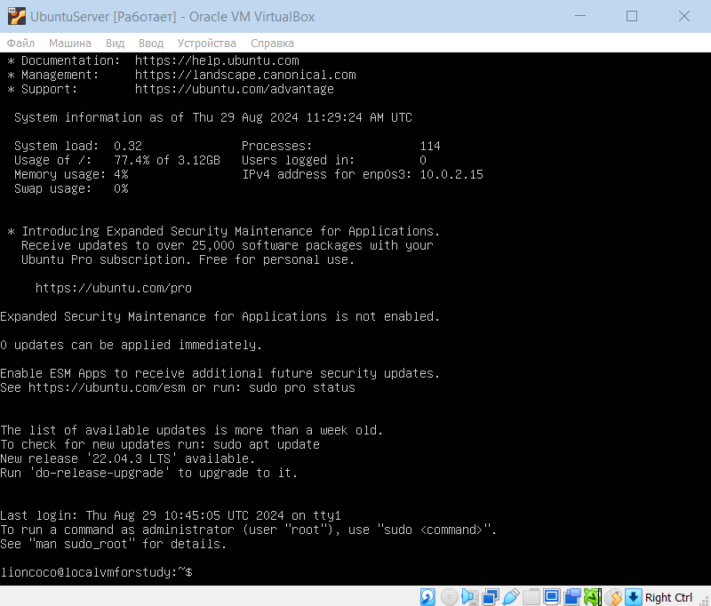
   - [x] Выполнить команду `cat /etc/issue` для проверки версии Ubuntu.
   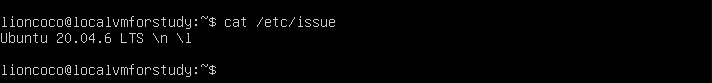

      Вывод команды показывает версию установленной системы **Ubuntu 20.04.6 LTS**

## Part 2. Создание пользователя и добавление его в группу adm

   - [x] Создать нового пользователя, отличного от пользователя, созданного при установке
      ```bash
        sudo useradd username  # команда для создания пользователя
        # лучше использовать adduser
      ```
   - [x] Добавить пользователя в группу **adm**
      ```bash
        sudo usermod -aG adm username  # команда для добавления пользователя в группу adm
        groups username  # команда выводит список групп, к которым принадлежит указанный пользователь.

      ```
      
   - [x] Выполнена команда `cat /etc/passwd` для проверки существования пользователя.
   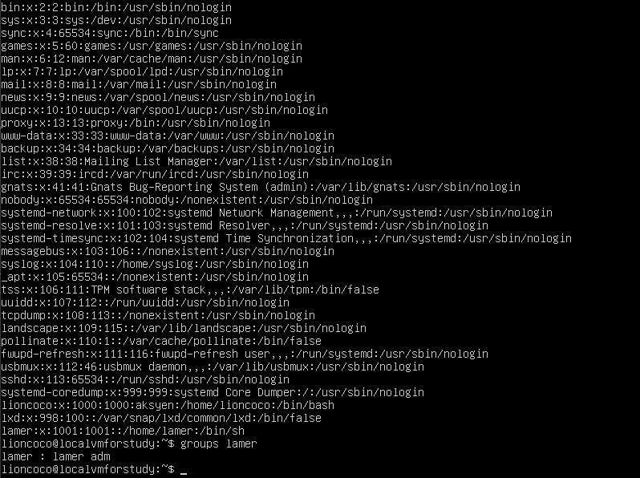
   - [x] Новый пользователь успешно создан и добавлен в группу adm, как показано на скриншотах.
   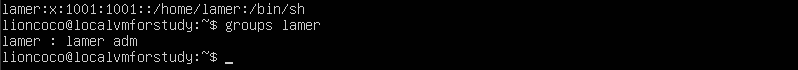

## Part 3. Настройка сети ОС

   - [x] Задать имя машины вида `user-1`
     ```bash
        sudo hostnamectl set-hostname user-1
     ```
     
   - [x] Установить временную зону:
     ```bash
        sudo timedatectl set-timezone Europe/Moscow
        cat /etc/timezone  # вывод timezone
     ```
     
     

   - [x] Вывести названия сетевых интерфейсов.
     ```bash
        ip link show
     ```
     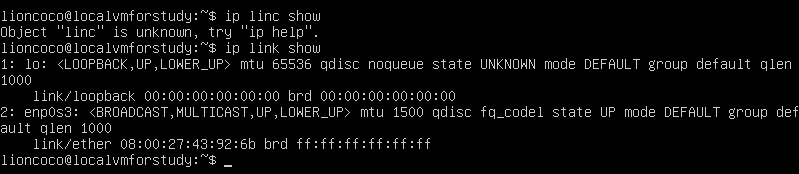
   - [x] Объяснение интерфейса `lo`

      Интерфейс `lo` — это loopback device – виртуальный интерфейс, присутствующий по умолчанию в любом Linux. Он используется для отладки сетевых программ и запуска серверных приложений на локальной машине. С этим интерфейсом всегда связан адрес 127.0.0.1. У него есть dns-имя – localhost

   - [x] Получить IP-адрес устройства от DHCP-сервера
     ```bash
        ip addr show
        # ip a  аналог
     ```
     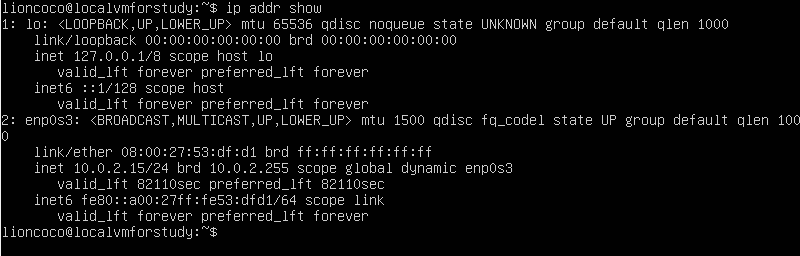
   - [x] Объяснение интерфейса `DHCP`

      DHCP (Dynamic Host Configuration Protocol англ.) — протокол динамической настройки узла, позволяющий устройствам автоматически получать IP-адрес, данные о DNS-сервере и другие параметры, необходимые для работы в сети.

   - [x] Внешний и внутренний IP адрес
     ```bash
        ip route show
        curl ifconfig.me  # Внешний
     ```
      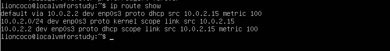
      

   - [x] Задать статичные настройки сети
     ```bash
        sudo nano /etc/netplan/00-installer-config.yaml
     ```
     

   - [x] Сохранить и перезагрузить
     ```bash
        sudo netplan apply && sudo reboot
     ```
   - [x] Проверка настройки сети
     ```bash
        ip a
     ```
     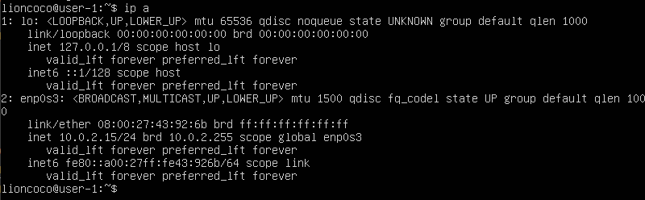

   - [x] Пропинговать удаленные хосты `1.1.1.1`, `8.8.8.8` и `ya.ru`
     ```bash
        ping -c 4 1.1.1.1
        ping -c 4 8.8.8.8
        ping -c 4 ya.ru
     ```
     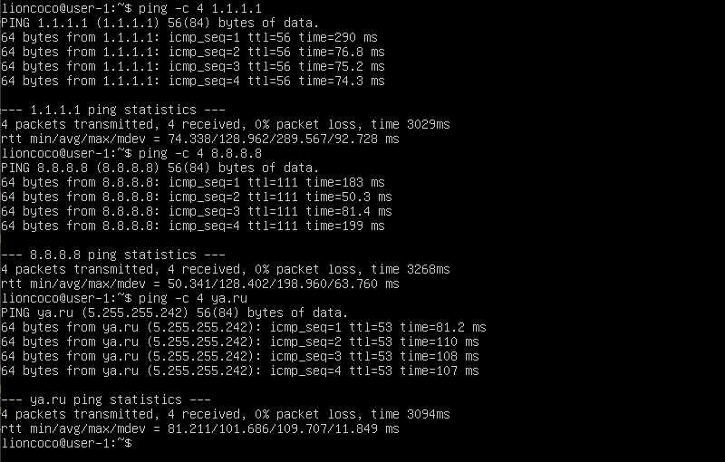

   - **Описание**: Сеть настроена, настройки проверены, пинг до удаленных хостов прошел успешно.

## Part 4. Обновление ОС

   - [x] Обновить системные пакеты до последней версии
     ```bash
        sudo apt update && sudo apt upgrade
     ```
   - [x] Повторно проверить наличие обновлений
     ```bash
        sudo apt update && sudo apt upgrade
     ```
      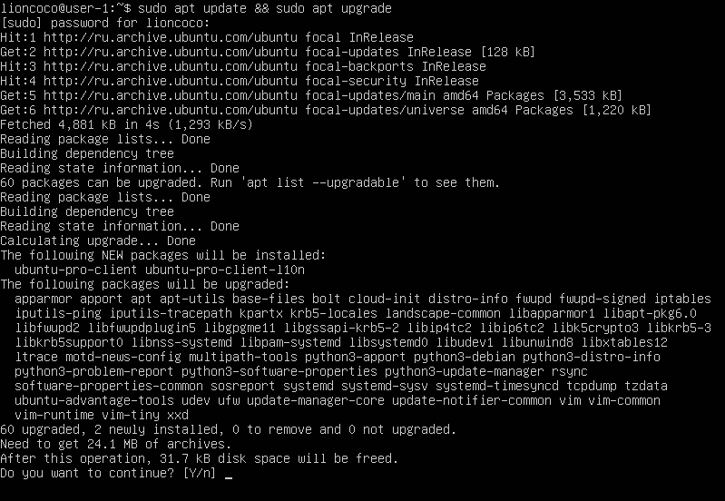
      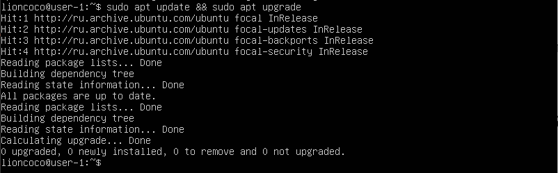

   - **Описание**: Все системные пакеты обновлены до последней версии.

## Part 5. Использование команды sudo

Настройка sudo для пользователя, созданного в Part 2.
   - [x] Разрешить пользователю выполнение команд с `sudo`
     ```bash
        sudo usermod -aG sudo username
     ```
   - [x] Объяснить назначение команды `sudo`

     `sudo` позволяет временно получить права суперпользователя для выполнения административных команд

   - [x] Изменить hostname с использованием sudo
     ```bash
        su - username  # смена пользователя
        sudo hostnamectl set-hostname user-new  # смена hostname
        hostname  # текущий hostname
     ```
     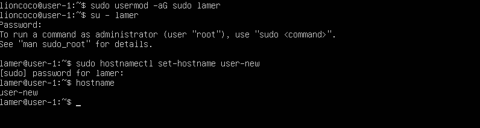

   - **Описание**: Новый пользователь успешно использует sudo для выполнения административных задач.

## Part 6. Установка и настройка службы времени

   - [x] Настроить службу времени
     ```bash
        sudo apt install systemd-timesyncd
        sudo timedatectl set-timezone Europe/Moscow
        sudo timedatectl set-ntp true
     ```
   - [x] Проверить текущее время
     ```bash
        timedatectl
     ```
   - [x] Проверить синхронизацию времени
     ```bash
        timedatectl show
     ```
      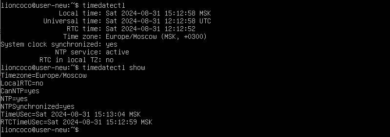

   - **Описание**: Время синхронизировано, служба времени настроена корректно.

## Part 7. Установка и использование текстовых редакторов

   - [x] Установить текстовые редакторы **VIM**, **NANO**, и **MCEDIT**
     ```bash
        sudo apt install vim nano mcedit
     ```
   - [x] Создать файлы в каждом редакторе с никнеймом, сохранить и закрыть
     ```bash
        vim test_vim.txt
        nano test_nano.txt
        mcedit test_mcedit.txt
     ```
   - **VIM** `Esc` `:wq`

     

   - **NANO** `Cntrl+O` `Enter` `Cntrl+X`

     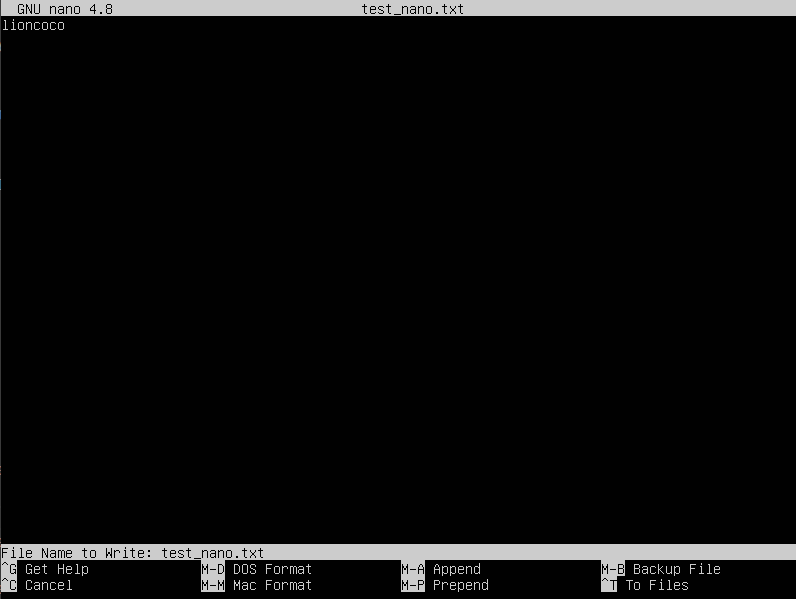

   - **MCEDIT** `F2` `Enter` `F10`

     

   - [x] Отредактировать файлы, заменить никнейм на `21 School 21`, закрыть без сохранения.

   - **VIM** `Esc` `:q!`

     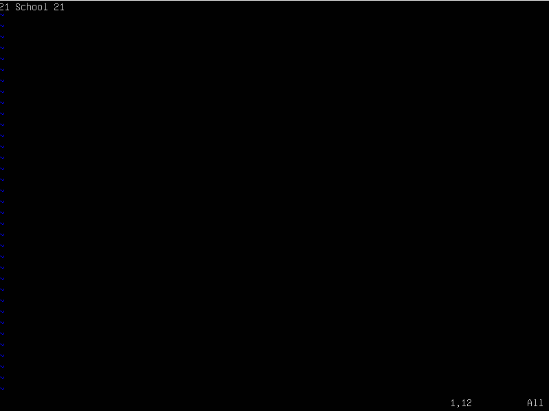
   - **NANO** `Cntrl+X` `N`

     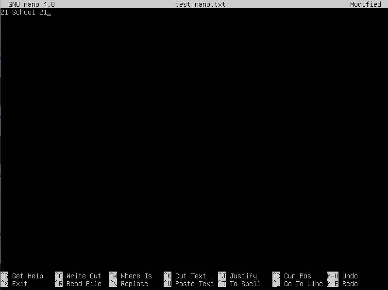
   - **MCEDIT** `F10` `No` `Enter`

     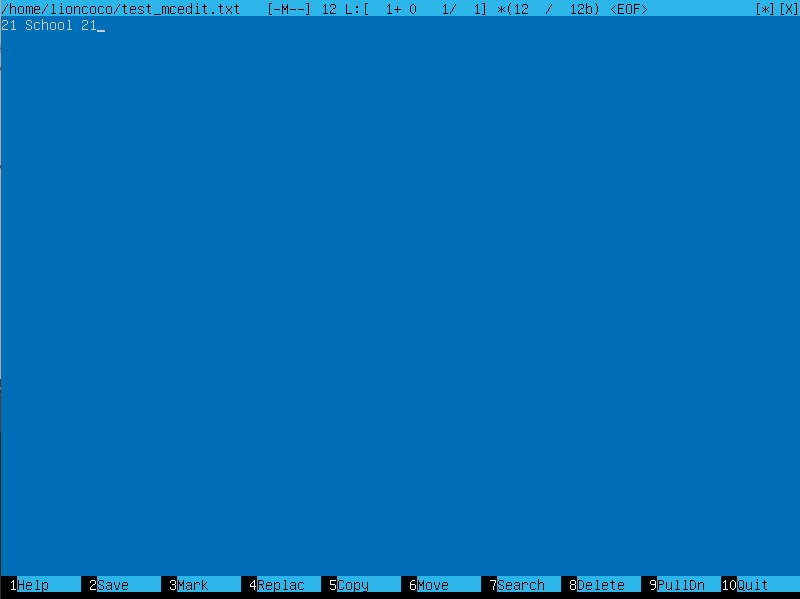
     
   - [x] Ввести команды для поиска и замены слов в каждом редакторе.

     1.1 Поиск слова в **Vim**
      - Откройте файл 
        ```bash
         vim имя_файла
        ```
      - Нажмите `/` и введите слово, которое хотите найти, затем нажмите `Enter`
        ```bash
         /слово
        ```
      - Используйте `n` для перехода к следующему совпадению и `N` для перехода к предыдущему

      

     1.2 Замена слова в **Vim**
      - Войдите в командный режим, нажав `Esc`
      - Введите команду замены
        ```bash
         :%s/старое_слово/новое_слово/g
        ```
        `%` указывает на всю область текста
        `s` — команда замены
        `/g` — глобальная замена, т.е. замена всех вхождений в строке

        Если хотите подтвердить каждую замену, используйте
        ```bash
         :%s/старое_слово/новое_слово/gc
        ```
        `c` означает "confirm" — запрос подтверждения на каждую замену

      

     2.1 Поиск слова в **Nano**
      - Откройте файл
        ```bash
           nano имя_файла
        ```
      - Нажмите `Ctrl + W` (где `W` означает "Where is") и введите слово, которое хотите найти. Нажмите `Enter`

      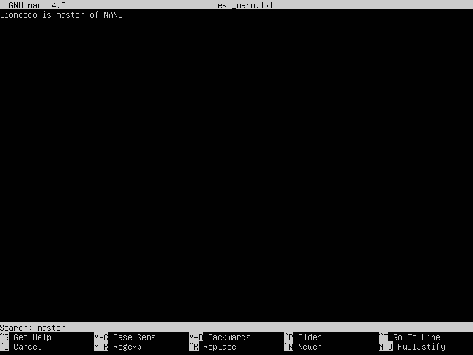

     2.2 Замена слова в **Nano**
      - Найдите слово, которое хотите заменить, с помощью `Ctrl + W`
      - После этого нажмите `Ctrl + \` (где `\` означает "Replace")
      - Введите слово, которое хотите заменить, и нажмите `Enter`
      - Введите новое слово и нажмите `Enter`
      - Nano предложит подтверждение для каждой замены.  Нажмите `Y` для замены или `N` для пропуска

      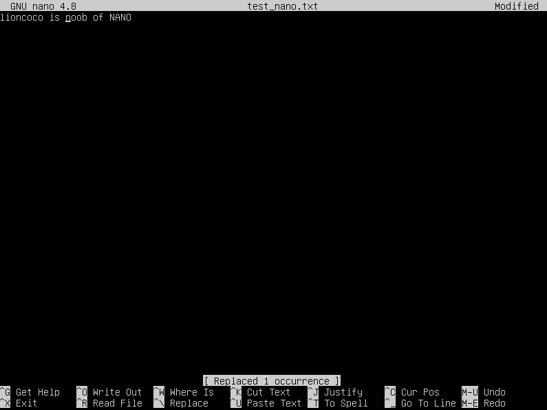
      
     3.1 Поиск слова в **MCEdit**

      - Откройте файл
        ```bash
           mcedit имя_файла
        ```
      - Нажмите `F7`, чтобы открыть диалог поиска
      - Введите слово, которое хотите найти, и нажмите `Enter`

      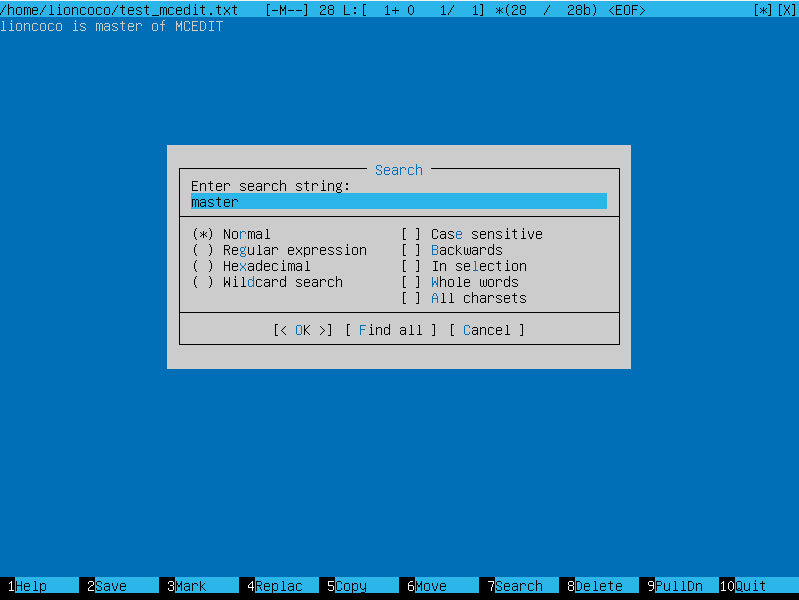

     3.2 Замена слова в **MCEdit**
      - Нажмите `F4`, чтобы открыть диалог замены
      - В поле "Заменить" введите слово, которое хотите заменить
      - В поле "На" введите новое слово
      - Выберите "Замена" для подтверждения замены. `MCEdit` предложит вам подтвердить замену для каждого совпадения, если вы выберете соответствующую опцию

      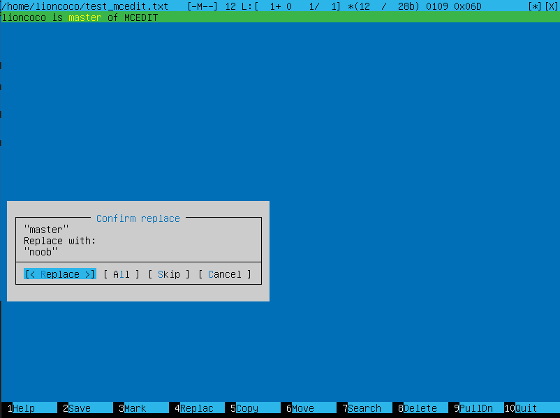
      
   - **Описание**: Выполнены операции редактирования, поиска и замены текста в выбранных редакторах.

## Part 8. Установка и базовая настройка сервиса SSHD

   - [x] Установить SSHd и добавить в автозапуск
     ```bash
        sudo apt update
        sudo apt install ssh
        sudo apt install openssh-server
        sudo systemctl enable ssh  # настроить автозапуск службы
     ```
   - [x] Перенастроить SSHd на порт `2022`
     ```
        sudo nano /etc/ssh/sshd_config
     ```
        Найти строку `Port 22` и заменить на `Port 2022`

     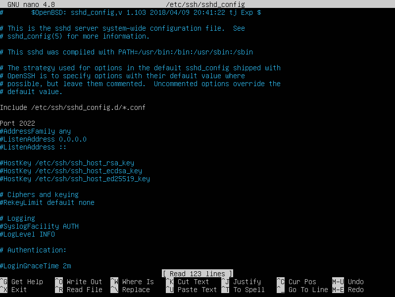

   - [x] Командой `ps` показать наличие процесса sshd
     ```bash
        ps -aux | grep sshd

        ps -C sshd # альтернативный способ
     ```
     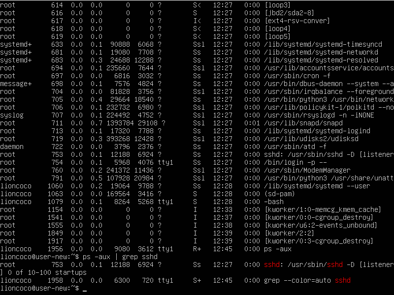

     

     `ps` - команда, которая выводит статистику и информацию о состоянии процессов в системе, в том числе ИД процесса или нити, объем выполняемого ввода-вывода и используемый объем ресурсов процессора и памяти. 
     Список ключей: 

     `-A`, `-e`, (`a`) - выбрать все процессы; 

     `-a` - выбрать все процессы, кроме фоновых; 

     `-d`, (`g`) - выбрать все процессы, даже фоновые, кроме процессов сессий; 

     `-N` - выбрать все процессы кроме указанных; 

     `-С` - выбирать процессы по имени команды; 

     `-G` - выбрать процессы по ID группы; 

     `-p` - выбрать процессы PID; 

     `--ppid` - выбрать процессы по PID родительского процесса; 

     `-s` - выбрать процессы по ID сессии; 

     `-t` - выбрать процессы по tty; 

     `-u`, (`U`) - выбрать процессы пользователя.

   - [x] Перезагрузить систему, ароверить настройки
     ```bash
        sudo reboot  # перезагрузить систему
        # sudo systemctl restart ssh можно перезапустить службу
        sudo apt install net-tools  # установить net-tools
        sudo netstat -tan
     ```

      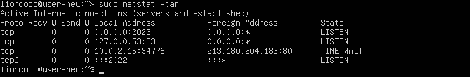

     Вызов команды `sudo netstat -tan` для вывода списка открытых портов и соответствующих им адресов, таблиц маршрутизации и скрытых соединений.

   - Список ключей и расшифровка вывода: 

     `-t` - Отображение текущего подключения в состоянии переноса нагрузки с процессора на сетевой адаптер передаче данных ( "offload" ) 

     `-a` - Отображение всех подключений и ожидающих портов

     `-n` - Отображение адресов и номеров портов в числовом формате

     `Proto` - Протокол, используемый сокетом

     `Recv-Q` - Счётчик байт не скопированных программой пользователя из этого сокета

     `Send-Q` - Счётчик байтов, не подтверждённых удалённым узлом

     `Local Address` - Адрес и номер порта локального конца сокета. Если не указана опция `--numeric` (`-n`), адрес сокета преобразуется в каноническое имя узла (`FQDN`), и номер порта преобразуется в соответствующее имя службы

     `Foreign Address` - Адрес и номер порта удалённого конца сокета. Аналогично `Local Address`

     `State` - Состояние сокета

     `0.0.0.0` -  это немаршрутизируемый адрес IPv4, который используется в качестве адреса по умолчанию или адреса-заполнителя

   - **Описание**: Служба SSHd успешно настроена и работает на порту 2022.

## Part 9. Установка и использование утилит top, htop

   - [x] Установить утилиты top и htop, запустить

     ```bash
        sudo apt install htop
        top
        htop
     ```
   - [x] Определить параметры по выводу команды `top`

     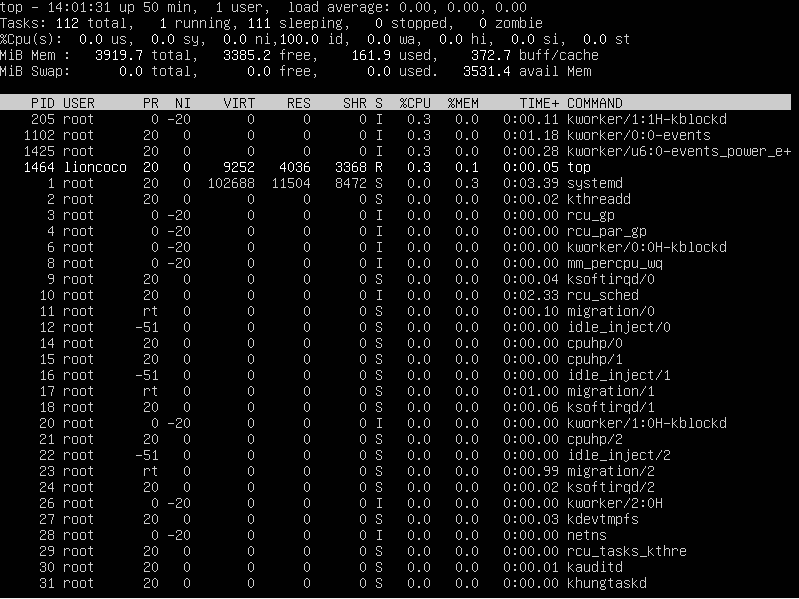
     


   - **Время работы системы (uptime):** 50 минут
   - **Количество авторизованных пользователей:** 1 пользователь
   - **Средняя загрузка системы:** 0.00, 0.00, 0.00
   - **Общее количество процессов:** 112 процессов
   - **Загрузка CPU:** 0.0% (все ядра находятся в состоянии бездействия - 100.0% id)
   - **Загрузка памяти:** Всего: 3919.7 MiB, Свободно: 3385.2 MiB, Занято: 161.9 MiB, Буфер/Кеш: 372.7 MiB
   - **PID процесса, занимающего больше всего памяти:** PID 1 (systemd) - RES: 11504 KiB
   - **PID процесса, занимающего больше всего процессорного времени:** PID 1 (systemd) - TIME+: 00:03.39

   - [x] Определить параметры по выводу команды `htop`

     Настройка сортировки:

     - **По PID**: Нажмите `F6`, выберите `PID` и нажмите `Enter`

       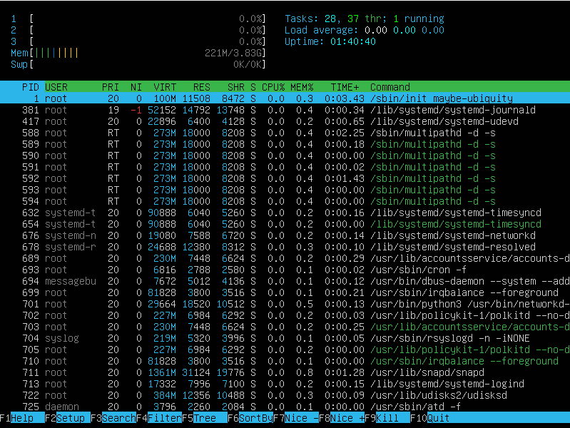

     - **По CPU%**: Нажмите `F6`, выберите `PERCENT_CPU` и нажмите `Enter`

       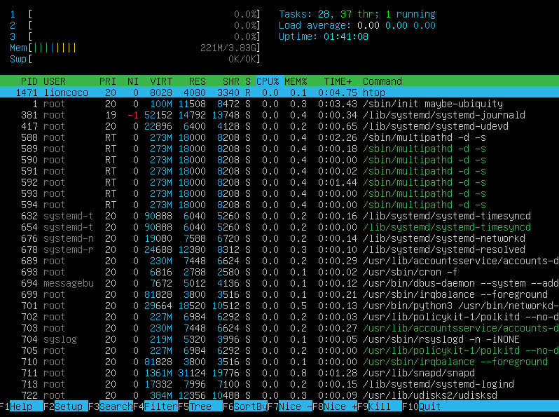

     - **По MEM%:** Нажмите `F6`, выберите `PERCENT_MEM` и нажмите `Enter`

       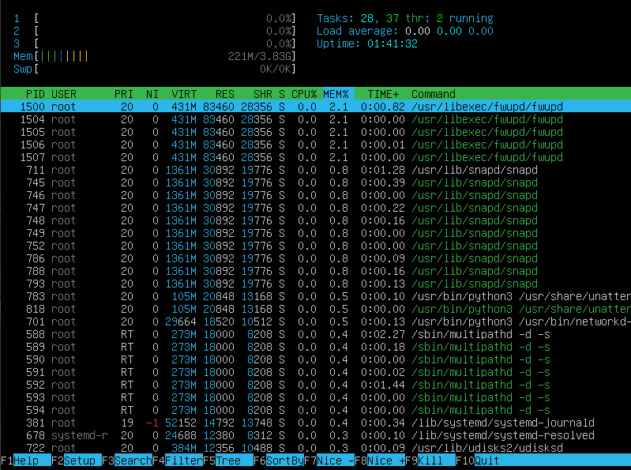

     - **По TIME+:** Нажмите `F6`, выберите `TIME` и нажмите `Enter`

       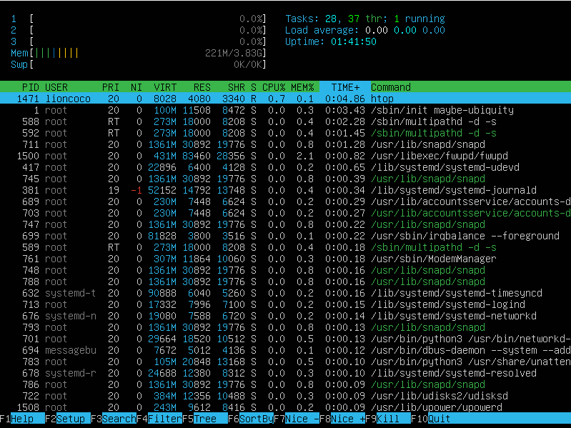


     Отфильтруйте процессы `sshd`:

     - Нажмите `F4` для фильтрации.
     - Введите `sshd` и нажмите `Enter`

       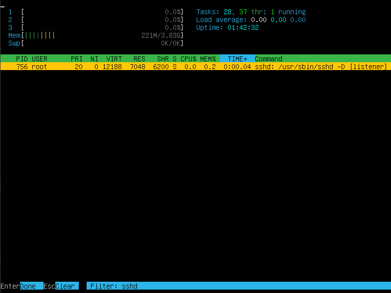

     Поиск процесса `syslog`:

     - Нажмите `/` (косая черта), чтобы запустить поиск.
     - Введите `syslog` и нажмите `Enter`

       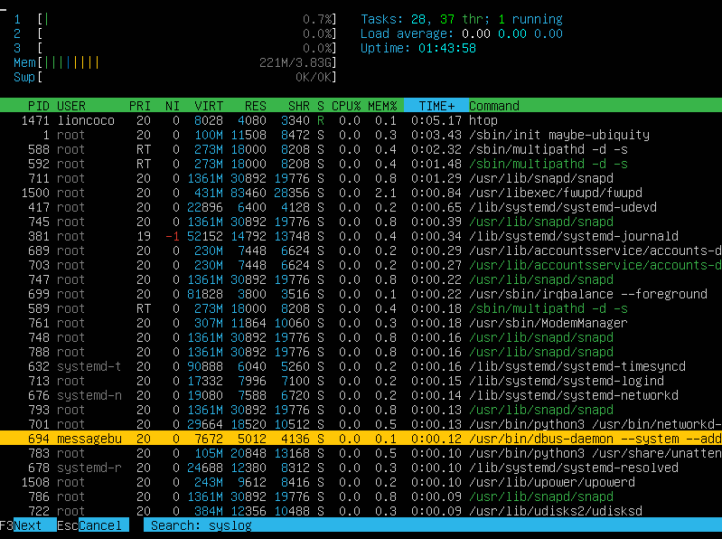

     Добавьте вывод `hostname`, `clock`, и `uptime`:**

     - Нажмите `F2` для входа в меню настроек (Setup).
     - Убедитесь, что отмечены опции `Hostname`, `Clock`, и `Uptime`.
     - Нажмите `Esc`, чтобы вернуться к основному экрану.

       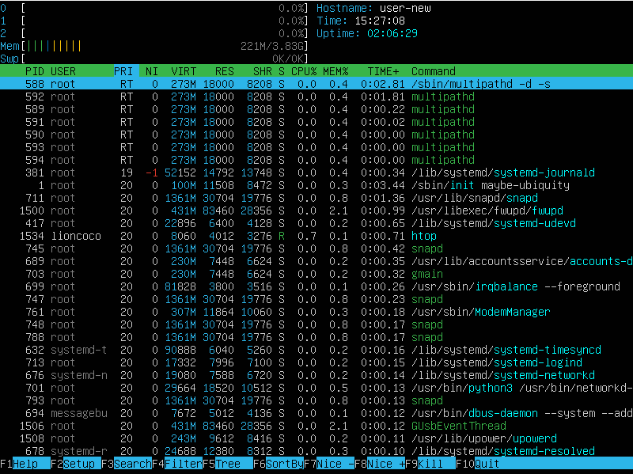

   - **Описание**: Утилиты top и htop успешно установлены и использованы для мониторинга системы.

## Part 10. Использование утилиты fdisk

Получение информации о жестком диске.
   - [x] Выполнить команду `fdisk -l`
     ```bash
        sudo fdisk -l  # посмотреть информацию о диске
     ```
     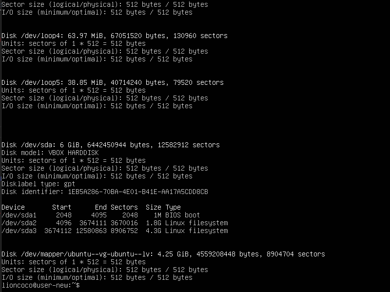

   - **Название жесткого диска**: VBOX HARDDISK
   - **Размер диска**: 6 GiB
   - **Количество секторов**: 12582912
   - **Размер swap**: не выделен
   - **Описание**: Информация о жестком диске и разделе swap получена.

## Part 11. Использование утилиты df

Получение информации о дисковом пространстве.
   - [x] Выполнена команда `df`

     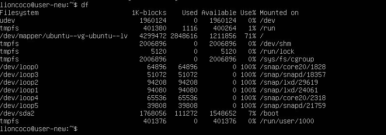

      - **Размер раздела:** 4299472 1K-blocks
      - **Размер занятого пространства:** 2848616 1K-blocks
      - **Размер свободного пространства:** 1211856 1K-blocks
      - **Процент использования:** 71%

      - **Единица измерения в выводе:** 1K-blocks, что соответствует блокам по 1024 байта == 1kiB (1 килобайт в СИ РФ или кикибайт в SI МЭК).
   - [x] Выполнена команда `df -Th`

     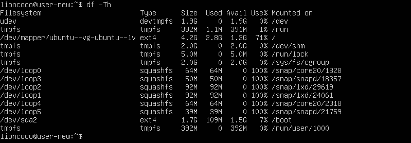


      - **Размер раздела:** 4.2 GiB
      - **Размер занятого пространства:** 2.8 GiB
      - **Размер свободного пространства:** 1.2 GiB
      - **Процент использования:** 71%


      - **Тип файловой системы:** `ext4`
   - **Описание**: Информация о файловой системе и использовании дискового пространства получена.

## Part 12. Использование утилиты du

Получение размера директорий

- [x] Вывести размеры папок `/home`, `/var`, `/var/log`:

  ```bash
     du  
     sudo du -sh /home     # в человекочитаемом виде
     sudo du -sh /var      # в человекочитаемом виде
     sudo du -sh /var/log  # в человекочитаемом виде
  ```
   
   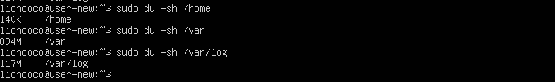
- [x] Вывести размеры содержимого папки `/var/log`:
  ```bash
  sudo du -sh /var/log/*   # в человекочитаемом виде
  ```
   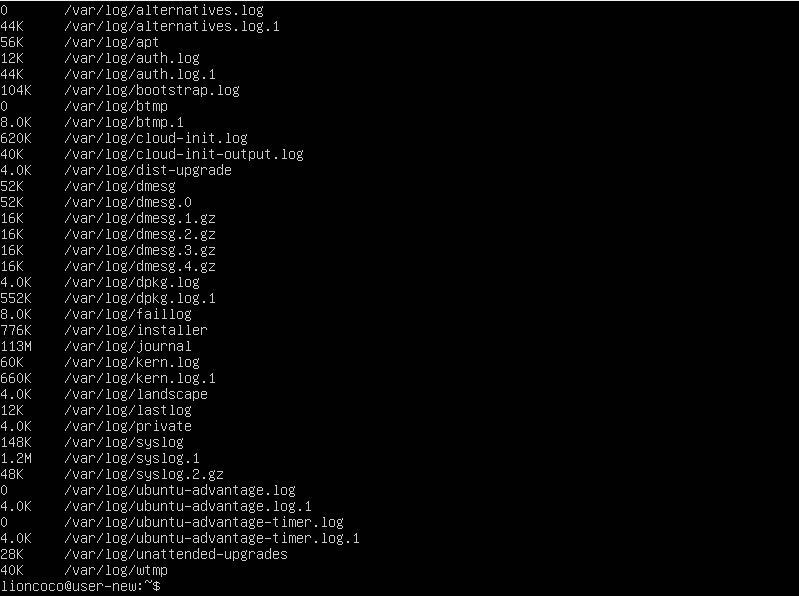

- **Описание**: Размеры директорий и их содержимого получены.

## Part 13. Установка и использование утилиты ncdu

   - [x] Установлена утилита ncdu
     ```bash
        sudo apt install ncdu
     ```
   - [x] Получены размеры папок `/home`, `/var`, `/var/log`
     ```bash
        ncdu /home
        ncdu /var
        ncdu /var/log
     ```

     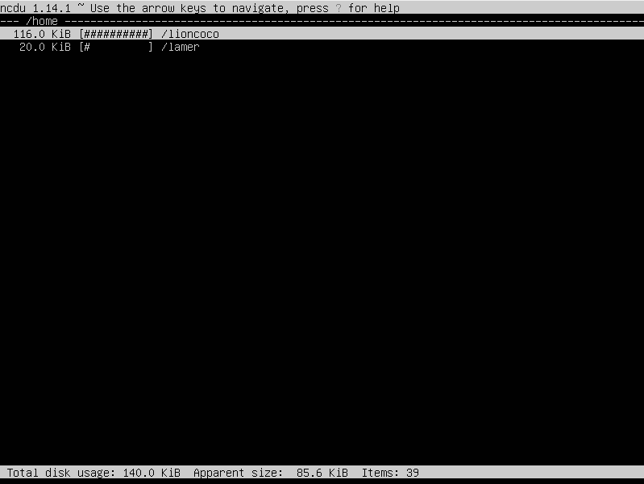
     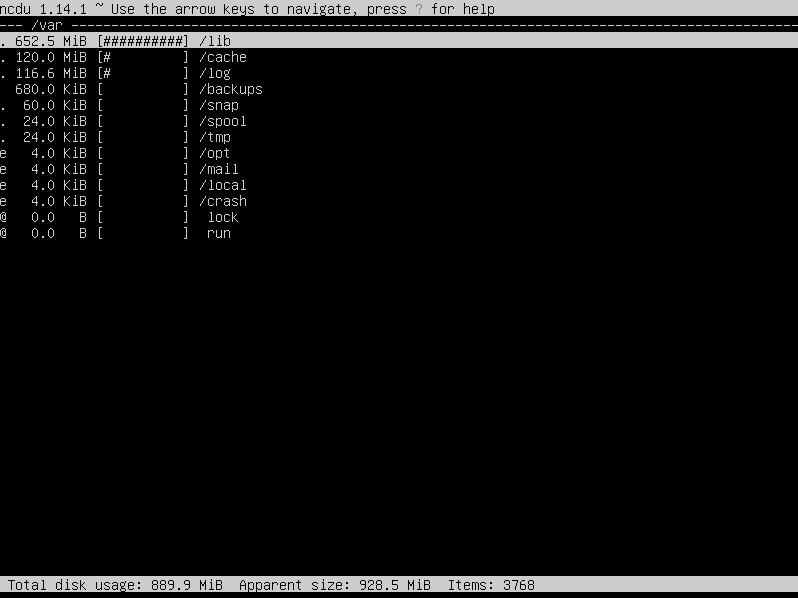
     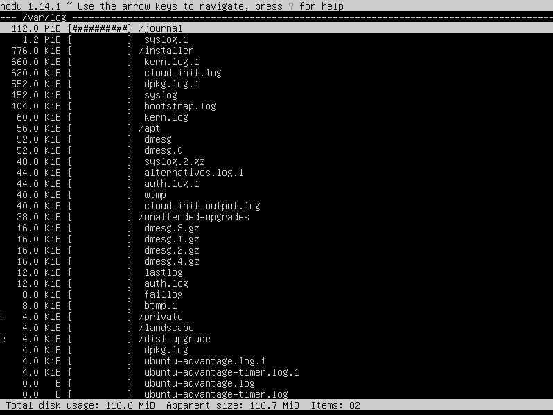

   - **Описание**: Результаты использования ncdu соответствуют данным, полученным с помощью du.

## Part 14. Работа с системными журналами

   - [x] Открыть журналы `/var/log/dmesg`, `/var/log/syslog`, `/var/log/auth.log`
     ```bash
        cat /var/log/dmesg
        cat /var/log/syslog
        cat /var/log/auth.log
     ```
      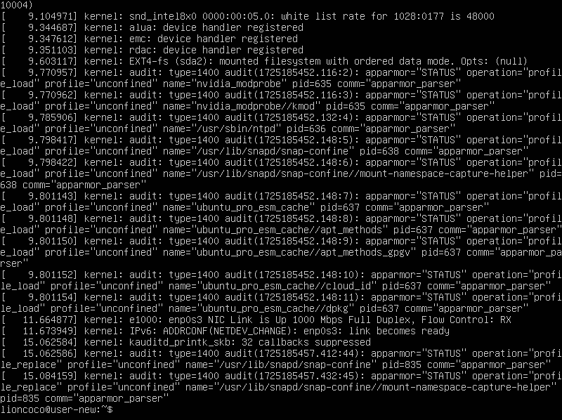
      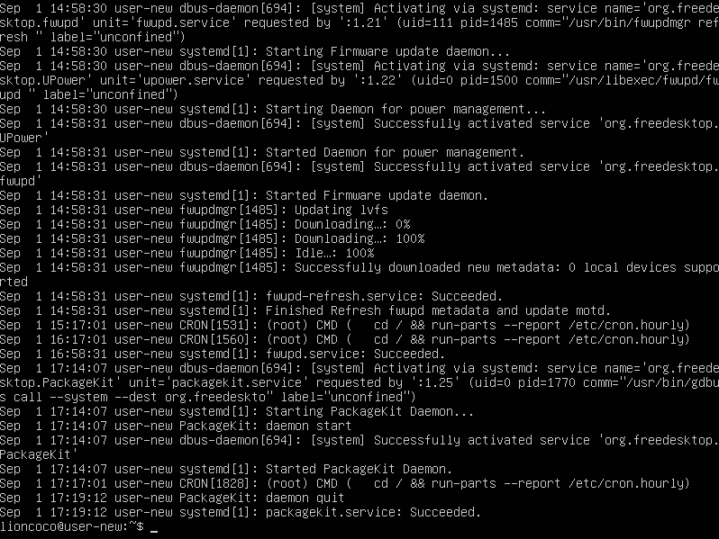
      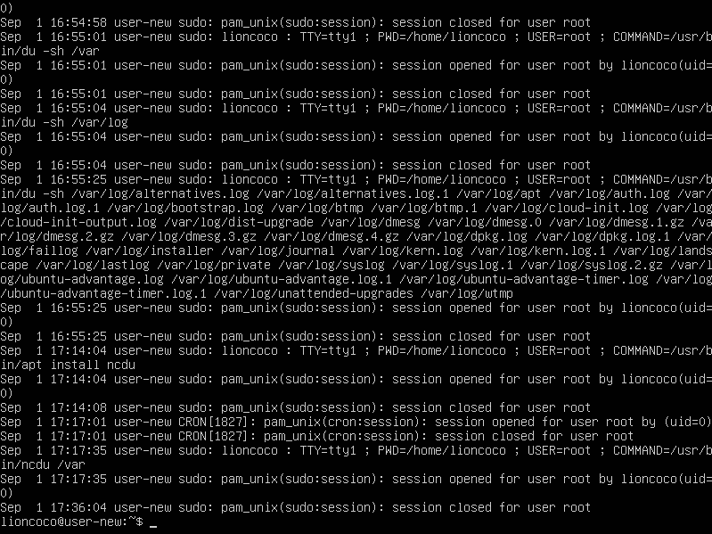

      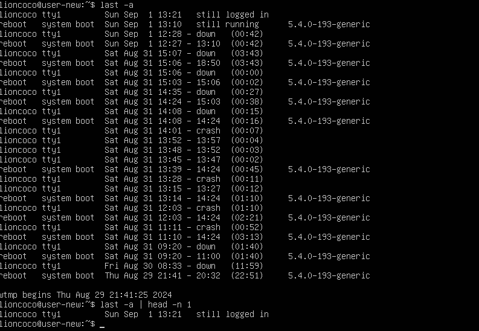
      - **Время последней успешной авторизации**:  13:21
      - **Имя пользователя**:  lioncoco
      - **Метод входа в систему**:  tty1 (вход через терминал)
   - [x] Перезапустить службу SSHd, в логах найти сообщение о рестарте.
     ```bash
        sudo systemctl restart ssh
        cat /var/log/syslog
     ```
      

   - **Описание**: Журналы системных событий просмотрены, данные о последних действиях получены.

## Part 15. Использование планировщика заданий CRON

   - [x] Настроить задание **CRON** на выполнение команды uptime каждые 2 минуты
     ```bash
        crontab -e
     ```
        В файле crontab добавить строку
     ```
        */2 * * * * /usr/bin/uptime
     ```
      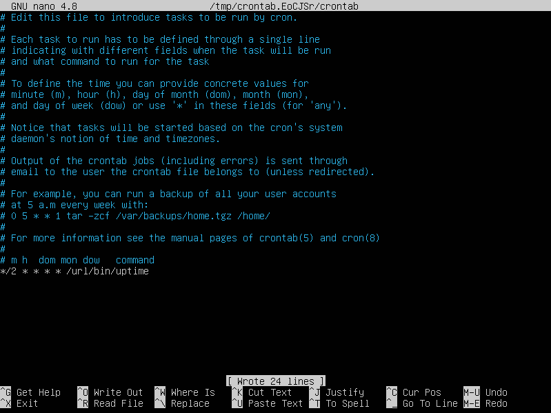

   - [x] Проверить строчки в журналах о выполнении задания
     ```bash
        cat /var/log/syslog
     ```
      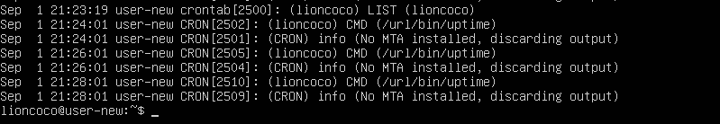

   - [x] Вывести список текущих заданий **CRON**
     ```bash
        crontab -l
     ```
      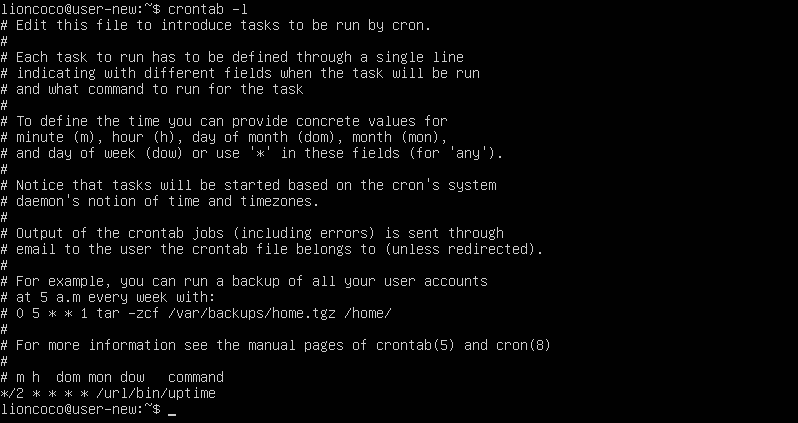

   - [x] Удалить все задания из **CRON**
     ```bash
        crontab -r
     ```
      

   - **Описание**: CRON настроен, проверен и очищен.