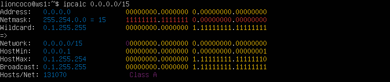
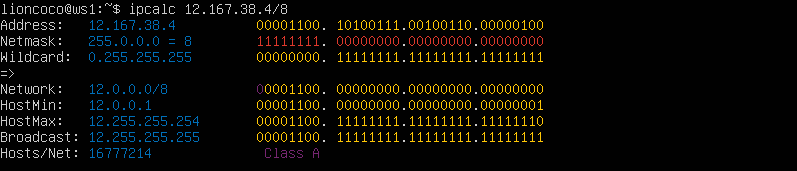
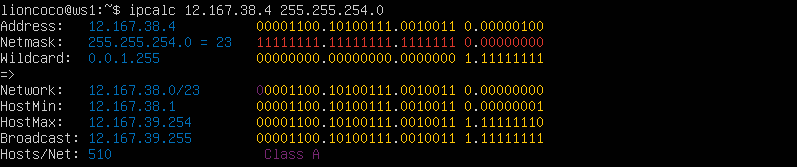
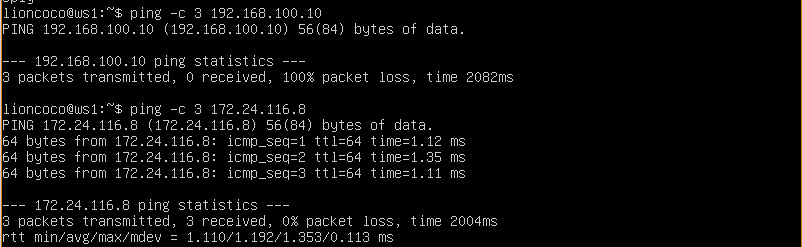
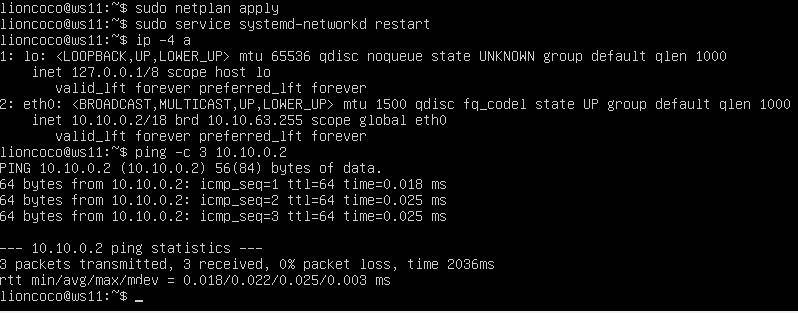

# Отчёт по выполнению заданий Сети в Linux

Вот краткое описание каждой утилиты из предосталенного списка, включая примеры использования, чтобы было легче ориентироваться в работе с сетями в Linux:

---

### 1. **ipcalc**
Утилита для вычислений в сетях. Помогает рассчитать маски подсети, количество доступных адресов и т. д.

**Пример:**
```bash
ipcalc 192.168.1.0/24
```
Выводит:
- Маску подсети
- Диапазон адресов
- Широковещательный адрес и другие данные.

---

### 2. **ip**
Современная утилита для управления сетями. Заменила `ifconfig`.

**Примеры:**
- Просмотр настроек интерфейсов:
  ```bash
  ip addr show
  ```
- Назначение IP-адреса:
  ```bash
  ip addr add 192.168.1.10/24 dev eth0
  ```
- Включение/выключение интерфейса:
  ```bash
  ip link set eth0 up
  ip link set eth0 down
  ```

---

### 3. **netplan**
Утилита для настройки сетей на системах с YAML-конфигурацией (`/etc/netplan/`).

**Пример:**
Файл конфигурации `/etc/netplan/01-netcfg.yaml`:
```yaml
network:
  version: 2
  renderer: networkd
  ethernets:
    eth0:
      addresses: [192.168.1.10/24]
      gateway4: 192.168.1.1
      nameservers:
        addresses: [8.8.8.8, 8.8.4.4]
```
Применение изменений:
```bash
sudo netplan apply
```

---

### 4. **netstat**
Используется для мониторинга сетевых соединений. Может быть заменён `ss`.

**Примеры:**
- Просмотр всех подключений:
  ```bash
  netstat -an
  ```
- Просмотр только слушающих портов:
  ```bash
  netstat -tuln
  ```

---

### 5. **iperf3**
Утилита для измерения пропускной способности сети.

**Пример:**
1. На сервере:
   ```bash
   iperf3 -s
   ```
2. На клиенте:
   ```bash
   iperf3 -c <IP-адрес сервера>
   ```

---

### 6. **iptables**
Фильтрация сетевого трафика на уровне ядра.

**Примеры:**
- Просмотр всех правил:
  ```bash
  sudo iptables -L
  ```
- Разрешить входящие соединения на порт 80:
  ```bash
  sudo iptables -A INPUT -p tcp --dport 80 -j ACCEPT
  ```
- Удалить правило:
  ```bash
  sudo iptables -D INPUT -p tcp --dport 80 -j ACCEPT
  ```

---

### 7. **ping**
Утилита для проверки доступности узла.

**Пример:**
```bash
ping 8.8.8.8
```
Отправляет ICMP-запросы и показывает время отклика.

---

### 8. **nmap**
Сканер сетей и портов.

**Примеры:**
- Сканирование открытых портов:
  ```bash
  nmap 192.168.1.1
  ```
- Сканирование диапазона IP:
  ```bash
  nmap 192.168.1.0/24
  ```
- Определение операционной системы:
  ```bash
  nmap -O 192.168.1.1
  ```

---

### 9. **sysctl**
Настройка параметров ядра в реальном времени.

**Примеры:**
- Просмотр параметров ядра:
  ```bash
  sysctl -a
  ```
- Включение маршрутизации:
  ```bash
  sysctl -w net.ipv4.ip_forward=1
  ```
- Постоянное изменение (в файле `/etc/sysctl.conf`):
  ```conf
  net.ipv4.ip_forward=1
  ```

---

### 10. **tcpdump**
Сниффер пакетов для анализа сетевого трафика.

**Примеры:**
- Просмотр трафика на интерфейсе:
  ```bash
  tcpdump -i eth0
  ```
- Фильтр по IP:
  ```bash
  tcpdump -i eth0 host 192.168.1.1
  ```
- Запись в файл:
  ```bash
  tcpdump -i eth0 -w capture.pcap
  ```

---

### 11. **traceroute**
Определяет маршрут до узла.

**Пример:**
```bash
traceroute 8.8.8.8
```
Выводит список маршрутизаторов между вашей машиной и указанным узлом.

---

### 12. **systemctl**
Управление службами в системах с systemd.

**Примеры:**
- Запуск службы:
  ```bash
  sudo systemctl start networking
  ```
- Перезапуск службы:
  ```bash
  sudo systemctl restart networking
  ```
- Статус службы:
  ```bash
  sudo systemctl status networking
  ```

---

### 13. **telnet**
Устаревшая утилита для подключения к удалённым системам через протокол Telnet.

**Пример:**
Подключение к серверу на порту 80:
```bash
telnet example.com 80
```

---

### 14. **dhclient**
Клиент DHCP для получения IP-адреса от DHCP-сервера.

**Пример:**
- Запрос нового IP-адреса:
  ```bash
  sudo dhclient eth0
  ```
- Освобождение текущего IP:
  ```bash
  sudo dhclient -r eth0
  ```

---

В дистрибутиве Ubuntu Server 20.04.6 LTS (live-server-amd64) по умолчанию предустановлены следующие сетевые утилиты:

- **ip**: утилита для управления сетевыми интерфейсами и маршрутами.
- **netplan**: система для конфигурации сетевых настроек с использованием YAML-файлов.
- **ping**: утилита для проверки доступности узлов в сети.
- **sysctl**: инструмент для настройки параметров ядра в реальном времени.
- **systemctl**: утилита для управления службами и системными состояниями в системах с systemd.
- **dhclient**: DHCP-клиент для получения IP-адресов от DHCP-сервера.

Остальные утилиты необходимо установить вручную. Ниже приведены команды для их установки:

- **ipcalc**: утилита для вычислений в сетях.
  ```bash
  sudo apt install ipcalc
  ```

- **net-tools**: пакет, включающий утилиту **netstat** для мониторинга сетевых соединений.
  ```bash
  sudo apt install net-tools
  ```

- **iperf3**: инструмент для измерения пропускной способности сети.
  ```bash
  sudo apt install iperf3
  ```

- **iptables**: утилита для настройки правил фильтрации трафика.
  ```bash
  sudo apt install iptables
  ```

- **nmap**: сканер сетей и портов.
  ```bash
  sudo apt install nmap
  ```

- **tcpdump**: сниффер пакетов для анализа сетевого трафика.
  ```bash
  sudo apt install tcpdump
  ```

- **traceroute**: утилита для определения маршрута до узла.
  ```bash
  sudo apt install traceroute
  ```

- **telnet**: утилита для подключения к удалённым системам через протокол Telnet.
  ```bash
  sudo apt install telnet
  ```

- **isc-dhcp-server**: утилита пакет DHCP-сервера.
  ```bash
  sudo apt install isc-dhcp-server
  ```

- **apache2**: утилита веб-сервер Apache.
  ```bash
  sudo apt install apache2
  ```

После установки этих утилит можно полноценно использовать их для настройки и диагностики сетевых соединений на вашем сервере Ubuntu 20.04.6 LTS. 

---

## Part 1. Инструмент **ipcalc**

- [x] Подними виртуальную машину (далее -- ws1)

  ![VirtualBox ws1[Работает]](images/virtual_box_ws1.png)

### 1.1. Сети и маски
- [x] Определи и запиши в отчёт:
  #### 1.1.1 Адрес сети 192.167.38.54/13
  ```bash
      ipcalc 192.167.38.54/13
  ```
  

  #### 1.1.2 Перевод маски 255.255.255.0 в префиксную и двоичную запись, /15 в обычную и двоичную, 11111111.11111111.11111111.11110000 в обычную и префиксную

  >Маска подсети определяет, какая часть IP-адреса относится к сети (network) и какая — к хостам (host) внутри этой сети.
  Маска представлена в виде 4 октетов (4 числа, разделённых точками).
  В двоичном виде маска состоит из единиц (1), которые указывают на часть адреса сети, и нулей (0), которые указывают на часть адреса хоста.

  **Перевод 255.255.255.0 в префиксную и двоичную запись**
  
  **Обычная десятичная запись**
  Маска записана как: `255.255.255.0`
  Каждое число (октет) — это 8 битов в десятичной системе.
  **Двоичная запись**
  Перевод каждого октета в двоичную форму:
  `255 → 11111111` (все биты — 1)
  `255 → 11111111`
  `255 → 11111111`
  `0 → 00000000`
  **Двоичная маска:** `11111111.11111111.11111111.00000000`
  
  **Префиксная запись**
  Префиксная запись показывает количество единиц (1) в маске.
  В `255.255.255.0` три октета полностью заняты единицами (3 × 8 = 24 бита).
  **Префиксная запись:** `/24`

  
  ---

  **Перевод префиксной записи /15 в обычную десятичную и двоичную запись**
  >Префикс **/15** означает, что первые 15 битов — единицы (1), а остальные — нули (0).

  **Обычная десятичная запись**
  Переведём каждую группу из 8 битов в десятичные числа:
  `11111111 → 255`
  `11111110 → 254`
  `00000000 → 0`
  `00000000 → 0`
  **Десятичная маска:** `255.254.0.0`
  **Двоичная запись**
  **Двоичная маска:** `11111111.11111110.00000000.00000000`

  
  ---

  **Перевод 11111111.11111111.11111111.11110000 в обычную и префиксную запись**

  **Обычная десятичная запись**
  Переведём каждую группу из 8 битов в десятичные числа:
  `11111111 → 255`
  `11111111 → 255`
  `11111111 → 255`
  `11110000 → 240`
  **Десятичная маска:** `255.255.255.240`
  **Префиксная запись**
  Посчитаем количество единиц (1) в маске: их 28.
  **Префиксная запись:** `/28`

  
  ---

  #### 1.1.3 Минимальный и максимальный хост в сети 12.167.38.4 при масках: /8, 11111111.11111111.00000000.00000000, 255.255.254.0 и /4

  **Маска /8**

  

  Адрес сети: `12.0.0.0`
  Минимальный хост: `12.0.0.1`
  Максимальный хост: `12.255.255.254`  
  <br>

  **Маска 11111111.11111111.00000000.00000000 (/16)**

  

  Адрес сети: `12.167.0.0`
  Минимальный хост: `12.167.0.1`
  Максимальный хост: `12.255.255.254`
  <br>

  **Маска 255.255.254.0 (/23)**

  
  Адрес сети: `12.167.38.0/23`
  Минимальный хост: `12.167.38.1`
  Максимальный хост: `12.255.39.254`
  <br>

  **Маска /4**

  

  Адрес сети: `0.0.0.0/4`
  Минимальный хост: `0.0.0.1`
  Максимальный хост: `15.255.255.254`
  <br>

### 1.2. localhost
- [x] Определи и запиши в отчёт, можно ли обратиться к приложению, работающему на localhost, со следующими IP: `194.34.23.100`, `127.0.0.2`, `127.1.0.1`, `128.0.0.1`.
<br>
  >localhost - в компьютерных сетях, стандартное, официально зарезервированное доменное имя для частных IP-адресов в диапазоне **127.0.0.1 — 127.255.255.254**.

  Обращение по адресами корректно:
  - [ ] **194.34.23.100**
  - [x] **127.0.0.2**
  - [x] **127.1.0.1**
  - [ ] **128.0.0.1**

### 1.3. Диапазоны и сегменты сетей
>К частным (серым) IP-адресам относятся IP-адреса из следующих подсетей:
От 10.0.0.0 до 10.255.255.255 с маской 255.0.0.0 или /8.
От 172.16.0.0 до 172.31.255.255 с маской 255.240.0.0 или /12.
От 192.168.0.0 до 192.168.255.255 с маской 255.255.0.0 или /16.
От 100.64.0.0 до 100.127.255.255 с маской подсети 255.192.0.0 или /10.
Это зарезервированные IP-адреса, которые предназначены для применения в закрытых локальных сетях. Распределение таких адресов никем не контролируется.
Напрямую доступ к сети Интернет с использованием частного IP-адреса невозможен. В этом случае связь с Интернетом осуществляется через NAT (трансляция сетевых адресов заменяет частный IP-адрес на публичный).
Частные IP-адреса в пределах одной локальной сети должны быть уникальны и не могут повторяться.

- [x] Определи и запиши в отчёт:
  #### 1.3.1 Какие из перечисленных IP можно использовать в качестве публичного, а какие только в качестве частных: 10.0.0.45, 134.43.0.2, 192.168.4.2, 172.20.250.4, 172.0.2.1, 192.172.0.1, 172.68.0.2, 172.16.255.255, 10.10.10.10, 192.169.168.1
  
  **Частные IP:** 10.0.0.45, 192.168.4.2, 172.20.250.4, 172.16.255.255 и 10.10.10.10
  **Публичные IP:** 134.43.0.2, 172.0.2.1, 192.172.0.1, 172.68.0.2, 192.169.168.1

  #### 1.3.2 Какие из перечисленных IP-адресов шлюза возможны у сети 10.10.0.0/18: 10.0.0.1, 10.10.0.2, 10.10.10.10, 10.10.100.1, 10.10.1.255
  
  Диапазон адресов по данной маске: `10.10.0.1-10.10.63.254`
  <bs>
  **IP-адреса возможны в сети 10.10.0.0/18:**
  - [ ] 10.0.0.1
  - [x] 10.10.0.2
  - [x] 10.10.10.10
  - [ ] 10.10.100.1
  - [x] 10.10.1.255

## Part 2. Статическая маршрутизация между двумя машинами

- [x] Подними две виртуальные машины (далее -- ws1 и ws2).
  

<bs>

- [x] С помощью команды `ip a` посмотри существующие сетевые интерфейсы.

  **ws1**
  
  **ws2**
  

<bs>

- [x] Опиши сетевой интерфейс, соответствующий внутренней сети, на обеих машинах и задай следующие адреса и маски: ws1 — 192.168.100.10, маска /16, ws2 — 172.24.116.8, маска /12.
  ```bash
  sudo nano /etc/netplan/00-installer-config.yaml
  ```
  
  >**enp0s3** — это имя сетевого интерфейса.
  >**dhcp4**: false — отключает использование DHCP.
  >**addresses** — задаёт статический IP-адрес для интерфейса с необходимой маской.
  >**gateway4** — шлюз по умолчанию.
  >**nameservers** — DNS-серверы для разрешения имен.

  **ws1 -> 00-installer-config.yaml**
  
  **ws2 -> 00-installer-config.yaml**
  

<bs>

- [x] Выполни команду netplan apply для перезапуска сервиса сети.
  **ws1**
  
  **ws2**
  

### 2.1. Добавление статического маршрута вручную

- [x] Добавь статический маршрут от одной машины до другой и обратно при помощи команды вида ip r add.
  ```bash
  sudo ip r add <адрес_сети> via <шлюз>
  ```
  `r` — это сокращение от "route" (маршрут) для работы с маршрутом. Оно указывает, что вы хотите изменить таблицу маршрутов.
  `add` — добавляет новый маршрут в таблицу маршрутизации.
  `via` — указывает, что маршрут к целевой сети проходит через указанный шлюз.

<bs>

- [x] Пропингуй соединение между машинами.


  **ws1**
  
  <bs>
  **ws2**
  


### 2.2. Добавление статического маршрута с сохранением
- [x] Перезапусти машины.
  **ws1**
  
  **ws2**
  

<bs>

- [x] Добавь статический маршрут от одной машины до другой с помощью файла /etc/netplan/00-installer-config.yaml.
  **ws1**
  
  **ws2**
  

<bs>

- [x] Пропингуй соединение между машинами.
  **ws1**
  
  **ws2**
  

## Part 3. Утилита iperf3
### 3.1. Скорость соединения
- [x] Переведи и запиши в отчёт: 8 Mbps в MB/s, 100 MB/s в Kbps, 1 Gbps в Mbps.

  **8 Mbps в MB/s:**
    - 1 байт = 8 бит.
    - Переводим мегабиты в мегабайты:
     \[
     8 \, \text{Mbps} \div 8 = 1 \, \text{MB/s}
     \]


  **100 MB/s в Kbps:**
   - Переводим мегабайты в килобайты:
     \[
     100 \, \text{MB/s} \times 1024 = 102400 \, \text{KB/s}
     \]
   - Переводим килобайты в килобиты:
     \[
     102400 \, \text{KB/s} \times 8 = 819200 \, \text{Kbps}
     \]


  **1 Gbps в Mbps:**
    - 1 гигабит = 1000 мегабит.
    \[
    1 \, \text{Gbps} = 1000 \, \text{Mbps}
    \]


  >**8 Mbps** = **1 MB/s**
  >**100 MB/s** = **819200 Kbps**
  >**1 Gbps** = **1000 Mbps**

### 3.2. Утилита iperf3

  #### Флаги для `iperf3`
  - `-s`: Запуск в режиме сервера.
  - `-c <IP-адрес>`: Запуск в режиме клиента с указанием IP-адреса сервера.
  - `-p <номер порта>`: Указывает порт для соединения (по умолчанию 5201).
  - `-i <интервал>`: Интервал вывода промежуточных результатов (в секундах).
  - `-t <время>`: Продолжительность теста в секундах (по умолчанию 10).
  - `-u`: Использовать протокол UDP вместо TCP.
  - `-b <пропускная способность>`: Устанавливает ограничение пропускной способности (для UDP).
  - `-R`: Тест в обратном направлении (сервер отправляет данные клиенту).
  - `-d`: Двусторонний тест (тест в обоих направлениях одновременно).
  - `-P <число потоков>`: Указывает количество параллельных потоков передачи.
  - `--logfile <имя файла>`: Сохраняет результаты теста в указанный файл.
  - `--get-server-output`: Показывает вывод сервера на клиенте после завершения теста.
  - `--json`: Вывод результатов в формате JSON.
  - `-f <формат>`: Устанавливает единицы измерения (`k`, `m`, `g` для килобайт, мегабайт и гигабайт соответственно).
  - `--version`: Отображает версию `iperf3`.
  - `-n <количество байт>`: Указывает объём данных для передачи вместо времени.
  - `-l <размер>`: Устанавливает размер буфера чтения/записи.
  - `-w <размер>`: Указывает размер TCP окна.
  - `--cport <порт>`: Устанавливает локальный порт клиента.
  - `--bind <адрес>`: Указывает локальный IP-адрес для исходящих соединений клиента.
  - `--no-delay`: Отключает алгоритм Нейгла (уменьшает задержки).

<bs>

  - [x] Измерь скорость соединения между ws1 и ws2.

    **ws1 - сервер, ws2 - клиент**
    
    
    <bs>
    **ws1 - клиент, ws2 - сервер**
    
    

## Part 4. Сетевой экран
### 4.1. Утилита iptables

#### **Общие флаги**
- `-A`: Добавить правило в конец цепочки.
- `-D`: Удалить правило из цепочки.
- `-I <цепочка> <номер>`: Вставить правило в указанную позицию.
- `-R <цепочка> <номер>`: Заменить правило по указанному номеру.
- `-L`: Список правил в цепочке.
- `-F`: Удалить все правила в указанной цепочке (или во всех цепочках, если цепочка не указана)
- `-X`: Удалить все пользовательские цепочки.
- `-P <цепочка> <политика>`: Установить политику по умолчанию.

#### **Фильтрация пакетов**
- `-p <протокол>`: Указать протокол (tcp, udp, icmp).
- `--sport <порт>`: Исходный порт.
- `--dport <порт>`: Целевой порт.
- `-s <адрес>`: Исходный IP-адрес.
- `-d <адрес>`: Целевой IP-адрес.
- `--icmp-type <тип>`: Тип ICMP-пакета.

#### **Действия (таргеты)**
- `-j ACCEPT`: Разрешить пакет.
- `-j DROP`: Заблокировать пакет без уведомления.
- `-j REJECT`: Заблокировать пакет с уведомлением.
- `-j LOG`: Записать информацию о пакете в журнал.

#### **Логирование**
- `--log-prefix <строка>`: Добавить префикс к записям в журнале.
- `--log-level <уровень>`: Указать уровень логирования (0–7).

#### **Таблицы**
- `-t filter`: Таблица для фильтрации пакетов (по умолчанию).
- `-t nat`: Таблица для NAT.
- `-t mangle`: Таблица для изменения пакетов.

#### **Цепочки**
- `INPUT`: Обрабатывает входящие пакеты.
- `OUTPUT`: Обрабатывает исходящие пакеты.
- `FORWARD`: Обрабатывает пересылаемые пакеты.
- `PREROUTING`: Обрабатывает пакеты до маршрутизации.
- `POSTROUTING`: Обрабатывает пакеты после маршрутизации.

#### **Дополнительные флаги**
- `-m state --state <состояние>`: Фильтрация по состоянию соединения (NEW, ESTABLISHED, RELATED).
- `-m limit --limit <число>`: Ограничение скорости (пакетов в секунду).
- `--conntrack <состояние>`: Отслеживание соединений (ESTABLISHED, RELATED, INVALID).
- `-v`: Подробный вывод правил.
- `-n`: Вывод IP-адресов и портов без преобразования.

<bs>

 - [x] Создай файл /etc/firewall.sh, имитирующий файрвол, на ws1 и ws2
    ```bash
    sudo nano /etc/firewall.sh
    ```

  - [x] Добавить в файл подряд следующие правила:

  1) На ws1 примени стратегию, когда в начале пишется запрещающее правило, а в конце пишется разрешающее правило (это касается пунктов 4 и 5).

  2) На ws2 примени стратегию, когда в начале пишется разрешающее правило, а в конце пишется запрещающее правило (это касается пунктов 4 и 5).

  3) Открой на машинах доступ для порта 22 (ssh) и порта 80 (http).

  4) Запрети echo reply (машина не должна «пинговаться», т. е. должна быть блокировка на OUTPUT).

  5) Разреши echo reply (машина должна «пинговаться»).
  **ws1**
  
  **ws2**
  

  - [x] Запусти файлы на обеих машинах командами chmod +x /etc/firewall.sh и /etc/firewall.sh.
  **ws1**
  
  **ws2**
  

<bs>

- [x] В отчёте опиши разницу между стратегиями, применёнными в первом и втором файлах.
  >При первой стратегии (применена на ws1) пинг этой виртуалки будет запрещен, а при второй (ws2) разрешен. Так получается потому, что правила применяются по порядку и если есть два противоречащих друг другу правила, то выполнится то, которое стоит первее.

### 4.2. Утилита nmap
  - [x] Командой ping найди машину, которая не «пингуется», после чего утилитой nmap покажи, что хост машины запущен.

    **ping**
  
  
  <bs>
  **nmap**
  
  

  `-Pn` — говорит nmap не использовать пинг для проверки доступности хоста (так как пинг может быть заблокирован), и сразу пытаться сканировать порты.

## Part 5. Статическая маршрутизация сети
**Сеть:**


- [x] Подними пять виртуальных машин (3 рабочие станции (ws11, ws21, ws22) и 2 роутера (r1, r2)).


### 5.1. Настройка адресов машин

  - [x] Настрой конфигурации машин в etc/netplan/00-installer-config.yaml согласно сети на рисунке.
  **ws11**
  
  **ws21**
  
  **ws22**
  
  **r1**
  
  **r2**
  

  - [x] Перезапусти сервис сети. Если ошибок нет, командой ip -4 a проверь, что адрес машины задан верно. Также пропингуй ws22 с ws21. Аналогично пропингуй r1 с ws11.
  **ws11**
  
  **ws21**
  
  **ws22**
  
  **r1**
  
  **r2**
  
  **Проверка соединений (ping) ws21 -> ws22**
  
  **Проверка соединений (ping) ws11 -> r1**
  

<bs>

### 5.2. Включение переадресации IP-адресов
  - [x] Для включения переадресации IP выполни команду на роутерах:
  `sysctl -w net.ipv4.ip_forward=1`
  **r1**
  
  **r2**
  

<bs>

  - [x] Открой файл /etc/sysctl.conf и добавь в него следующую строку:
  `net.ipv4.ip_forward = 1`
  **r1**
  
  **r2**
  
  **Применение изменения:**
    ```bash
    sudo sysctl -p
    ```
### 5.3. Установка маршрута по умолчанию
  - [x] Настрой маршрут по умолчанию (шлюз) для рабочих станций. Для этого добавь default перед IP-роутера в файле конфигураций.
  **ws11**
  
  **ws21**
  
  **ws22**
  

<bs>

  - [x] Вызови ip r и покажи, что добавился маршрут в таблицу маршрутизации.
  **ws11**
  
  **ws21**
  
  **ws22**
  

<bs>

  - [x] Пропингуй с ws11 роутер r2 и покажи на r2, что пинг доходит. Для этого используй команду:
  `tcpdump -tn -i eth0`
    >Параметры команды:
    -t: Скрыть метки времени.
    -n: Не преобразовывать адреса в имена хостов.
    -i eth0: Указать интерфейс для мониторинга (в данном случае, eth0 роутера r2).

    **ws11**
    
    **r2**
    

### 5.4. Добавление статических маршрутов

  - [x] Добавь в роутеры r1 и r2 статические маршруты в файле конфигураций.
  **r1**
  
  **r2**
  

  <bs>

  - [x] Вызови ip r и покажи таблицы с маршрутами на обоих роутерах.
  **r1**
  
  **r2**
  

  <bs>

  - [x] Запусти команды на ws11:
  `ip r list 10.10.0.0/[маска сети]` и `ip r list 0.0.0.0/0`
  
    >Маршрут по умолчанию выбирается в том случае, если не существует других доступных маршрутов до нужного адреса. В случае с адресом 10.10.0.0/18, собственный ip адрес виртуальной машины находится в той же сети и нет необходимости использовать default.

### 5.5. Построение списка маршрутизаторов

- [x] Запусти на r1 команду дампа: `tcpdump -tnv -i eth0`
  

<bs>

- [x] При помощи утилиты traceroute построй список мар  шрутизаторов на пути от ws11 до ws21.
**ws11**

**r1**

  >**Traceroute** основана на отправке udp фрагментов и получения сообщения о доступности/недостижимости порта. Вернемся к прошлой схеме. Host генерирует udp фрагмент, инкапсулирует его в IP пакет и выставляет ttl=1. Router1, являясь транзитным узлом, ответит на данный пакет icmp сообщением об окончании времени жизни пакета. Утилита traceroute, получив данное сообщение, указывает адрес источника icmp пакета как адрес первого хопа. Далее процесс повторяется с инкрементированием ttl пакета.

### 5.6. Использование протокола ICMP при маршрутизации

- [x] Запусти на r1 перехват сетевого трафика, проходящего через eth0 с помощью команды:
`tcpdump -n -i eth0 icmp`


- [x] Пропингуй с ws11 несуществующий IP (например, 10.30.0.111) с помощью команды:
`ping -c 1 10.30.0.111`
**ws11**

**r1**


<bs>

## Part 6. Динамическая настройка IP с помощью DHCP
- [x] Для r2 настрой в файле /etc/dhcp/dhcpd.conf конфигурацию службы DHCP:
**1. Укажи адрес маршрутизатора по умолчанию, DNS-сервер и адрес внутренней сети.**

  >subnet 10.100.0.0: Пустая подсеть, так как она служит только для связи между r1 и r2.
  subnet 10.20.0.0: Включает диапазон IP-адресов для выдачи (от 10.20.0.2 до 10.20.0.50), шлюзом является 10.20.0.1, а DNS-сервером — сам роутер (10.20.0.1).

  **2. В файле resolv.conf пропиши nameserver 8.8.8.8.**


<bs>

- [x] Перезагрузи службу DHCP командой `systemctl restart isc-dhcp-server`.


<bs>

- [x] Машину ws21 перезагрузи при помощи reboot и через ip a покажи, что она получила адрес. Также пропингуй ws22 с ws21.


<bs>

- [x] Укажи MAC-адрес у ws11, для этого в etc/netplan/00-installer-config.yaml надо добавить строки: `macaddress: 10:10:10:10:10:BA`, `dhcp4: true`.


<bs>

- [x] Для r1 настрой аналогично r2, но сделай выдачу адресов с жесткой привязкой к MAC-адресу (ws11). Проведи аналогичные тесты.
**r1 -> /etc/dhcp/dhcpd.conf**

**r1 -> /etc/resolv.conf**

**ws11 -> ping ws22**


<bs>

- [x] Запроси с ws21 обновление IP-адреса.


### Объяснение опций DHCP, использованных в данном задании
`range`: Указывает диапазон IP-адресов, которые DHCP-сервер может выдавать.
`option routers`: Задаёт шлюз по умолчанию для клиентов.
`option domain-name-servers`: Указывает DNS-сервер для клиентов.
`host`: Используется для создания привязки IP-адреса к MAC-адресу.
`fixed-address`: Задаёт статический IP-адрес для определённого устройства.

## Part 7. NAT

- [x] В файле /etc/apache2/ports.conf на ws22 и r1 измени строку `Listen 80` на `Listen 0.0.0.0:80`, то есть сделай сервер Apache2 общедоступным.
**ws22 -> /etc/apache2/ports.conf**

**r1 -> /etc/apache2/ports.conf**


<bs>

- [x] Запусти веб-сервер Apache командой `service apache2 start` на ws22 и r1.
**ws22**

**r1**


<bs>

- [x] Добавь в фаервол, созданный по аналогии с фаерволом из Части 4, на r2 следующие правила:

1) Удаление правил в таблице filter — `iptables -F`;

2) Удаление правил в таблице «NAT» — `iptables -F -t nat`;

3) Отбрасывать все маршрутизируемые пакеты — `iptables --policy FORWARD DROP`.


- [x] Запусти файл также, как в Части 4.


<bs>

- [x] Проверь соединение между ws22 и r1 командой `ping`.
При запуске файла с этими правилами, ws22 не должна «пинговаться» с r1.


<bs>

- [x] Добавь в файл ещё одно правило:

4) Разрешить маршрутизацию всех пакетов протокола ICMP.


<bs>

- [x] Запусти файл также, как в Части 4.


<bs>

- [x] Проверь соединение между ws22 и r1 командой `ping`.
При запуске файла с этими правилами, ws22 должна «пинговаться» с r1.


<bs>

- [x] Добавь в файл ещё два правила:

5) Включи SNAT, а именно маскирование всех локальных IP из локальной сети, находящейся за r2 (по обозначениям из Части 5 — сеть 10.20.0.0).

6) Включи DNAT на 8080 порт машины r2 и добавить к веб-серверу Apache, запущенному на ws22, доступ извне сети.
Совет: стоит учесть, что при попытке подключения возникнет новое tcp-соединение, предназначенное ws22 и 80 порту.


- [x] Запусти файл также, как в Части 4.


- [x] Проверь соединение по TCP для SNAT: для этого с ws22 подключиться к серверу Apache на r1 командой:
`telnet [адрес] [порт]`


<bs>

- [x] Проверь соединение по TCP для DNAT: для этого с r1 подключиться к серверу Apache на ws22 командой `telnet` (обращаться по адресу r2 и порту 8080).


## Part 8. Дополнительно. Знакомство с SSH Tunnels
- [x] Запусти на r2 фаервол с правилами из Части 7.


<bs>

- [x] Запусти веб-сервер Apache на ws22 только на localhost (то есть в файле /etc/apache2/ports.conf измени строку `Listen 80` на `Listen localhost:80`).


<bs>

- [x] Воспользуйся Local TCP forwarding с ws21 до ws22, чтобы получить доступ к веб-серверу на ws22 с ws21.
  >ssh -L [локальный_адрес:]локальный_порт:удаленный_адрес:удаленный_порт [пользователь@]сервер

  

<bs>

- [x] Воспользуйся Remote TCP forwarding c ws11 до ws22, чтобы получить доступ к веб-серверу на ws22 с ws11.
  >ssh -R [удаленный_адрес:]удаленный_порт:локальный_адрес:локальный_порт [пользователь@]сервер

  
  

<bs>

- [x] Для проверки, сработало ли подключение в обоих предыдущих пунктах, перейди во второй терминал (например, клавишами Alt + F2) и выполни команду: `telnet 127.0.0.1 [локальный порт]`
**ws21**

**ws11**


**Резюме**:
>**Local TCP Forwarding**:
Используется для доступа к удалённым ресурсам через локальный порт.

>**Remote TCP Forwarding**:
Используется для предоставления доступа к локальным ресурсам через удалённый порт.