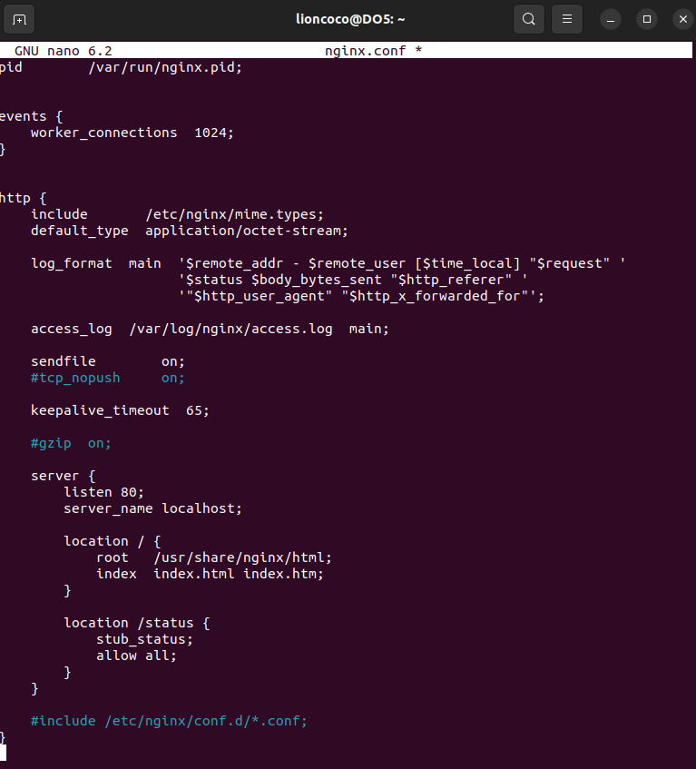
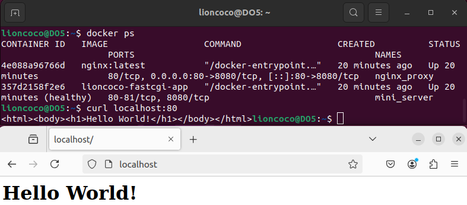

1. [Готовый докер](#part-1-готовый-докер)

2. [Операции с контейнером](#part-2-операции-с-контейнером)

3. [Мини веб-сервер](#part-3-мини-веб-сервер)

4. [Свой докер](#part-4-свой-докер)

5. [Dockle](#part-5-dockle)

6. [Базовый Docker Compose](#part-6-базовый-docker-compose)

**При выполнения проекта использовались следующие ресурсы**

[Справочный материал по Docker](https://docs.docker.com/)

[Установка Docker Engine на Ubuntu](https://docs.docker.com/engine/install/ubuntu/)

[Docker для начинающих + практический опыт](https://stepik.org/course/123300/syllabus)


## Part 1. Готовый докер  

**== Задание ==**

- [x] Возьми официальный докер-образ с nginx и выкачай его при помощи `docker pull`.

      

- [x] Проверь наличие докер-образа через `docker images`.

      

- [x] Запусти докер-образ через `docker run -d [image_id|repository]`. 

      

- [x] Проверь, что образ запустился через docker ps.

      

- [x] Посмотри информацию о контейнере через `docker inspect [container_id|container_name]`.

      


- [x] По выводу команды определи и помести в отчёт размер контейнера, список замапленных портов и ip контейнера.
размер контейнера:  

    >В последних версиях Docker команда `docker inspect` больше не отображает размеры контейнера. Для определения размера контейнера следует использовать другие подходы. Вот несколько способов, как это сделать:

    ```bash

    docker ps -s    # показывает список запущенных контейнеров с указанием их размера

    docker system df    # показывает использование дискового пространства Docker, включая размеры контейнеров, образов и volume
    
    ```

    **docker ps -s**

      

    **docker system df**

      

    **список замапленных портов**  

       

    **ip контейнера**

      

    **inspect | grep**

      

- [x] Останови докер контейнер через `docker stop [container_id|container_name]`.

      

- [x] Проверь, что контейнер остановился через `docker ps`.

      

- [x] Запусти докер с портами 80 и 443 в контейнере, замапленными на такие же порты на локальной машине, через команду `run`.

      

    **docker ps**

      

- [x] Проверь, что в браузере по адресу localhost:80 доступна стартовая страница nginx. 

      

      

- [x] Перезапусти докер контейнер через `docker restart [container_id|container_name]`.

      

- [x] Проверь любым способом, что контейнер запустился.

      

## Part 2. Операции с контейнером

**== Задание ==**

- [x] Прочитай конфигурационный файл `nginx.conf` внутри докер контейнера через команду `exec`.

    ```bash
    docker exec -i [container_id|container_name] cat /etc/nginx/nginx.conf  
    # Эта команда покажет содержимое конфигурационного файла прямо в терминале.
    
    ```

      


- [x] Создай на локальной машине файл `nginx.conf`.


      

- [x] Настрой в нем по пути /status отдачу страницы статуса сервера nginx.

      

- [x] Скопируй созданный файл nginx.conf внутрь докер-образа через команду `docker cp`. 

      

- [x] Перезапусти nginx внутри докер-образа через команду exec. 

      

- [x] Проверь, что по адресу `localhost:80/status` отдается страничка со статусом сервера nginx.  

      

- [x] Экспортируй контейнер в файл `container.tar` через команду `export`. 

      

- [x] Останови контейнер. 
  
      

- [x] Удали образ через `docker rmi [image_id|repository]`, не удаляя перед этим контейнеры.

      

- [x] Удали остановленный контейнер.

      

- [x] Импортируй контейнер обратно через команду `import`.  

      

- [x] Запусти импортированный контейнер.

      

- [x] Проверь, что по адресу `localhost:80/status` отдается страничка со статусом сервера nginx.

      


## Part 3. Мини веб-сервер  

**== Задание ==**

- [x] Напиши мини-сервер на C и FastCgi, который будет возвращать простейшую страничку с надписью `Hello World!`.  

      

- [x] Запусти написанный мини-сервер через `spawn-fcgi` на порту `8080`. 

    >для запуска мини веб-сервера на FastCGI понадобились утилиты: `spawn-fcgi` и `libfcgi-dev` 

    ```bash
    sudo apt install libfcgi-dev
        # Устанавливает заголовочные файлы (fcgi_stdio.h) и библиотеку FastCGI.
    sudo apt install spawn-fcgi
        # Утилита, чтобы запустить сервер как FastCGI-приложение
    ```

    Скомпилируем написанный мини-сервер

      

    Запускаем сервер на порту 8080  

      

- [x] Напиши свой `nginx.conf`, который будет проксировать все запросы с `81` порта на `127.0.0.1:8080`. 

       

    

    

- [x] Проверь, что в браузере по localhost:81 отдается написанная тобой страничка.

      

- [x] Положи файл nginx.conf по пути ./nginx/nginx.conf (это понадобится позже). 

      


## Part 4. Свой докер  

**== Задание ==**

- [x] Напиши свой докер-образ, который:

    1) собирает исходники мини сервера на `FastCgi` из [Части 3](#part-3-мини-веб-сервер);

    2) запускает его на `8080` порту;

    3) копирует внутрь образа написанный `./nginx/nginx.conf`;

    4) запускает nginx..

      


- [x] Собери написанный докер-образ через `docker build` при этом указав имя и тег.

      

- [x] Проверь через docker images, что все собралось корректно. 

      

- [x] Запусти собранный докер-образ с маппингом `81` порта на 80 на локальной машине и маппингом папки `./nginx` внутрь контейнера по адресу, где лежат конфигурационные файлы nginx'а [(см. Часть 2)](#part-2-операции-с-контейнером).  

      

- [x] Проверь, что по `localhost:80` доступна страничка написанного мини сервера.

      

- [x] Допиши в ./nginx/nginx.conf проксирование странички /status, по которой надо отдавать статус сервера nginx.  

      

- [x] Перезапусти докер-образ.  

    Поскольку папка `nginx` была смонтирована в контейнер, изменения в конфигурации автоматически подхватятся.

      

- [x] Проверь, что теперь по `localhost:80/status` отдается страничка со статусом `nginx` 

     

## Part 5. **Dockle**  

**== Задание ==** 

- [x] Просканируй образ из предыдущего задания через `dockle [image_id|repository]`. 

      

- [x] Исправь образ так, чтобы при проверке через dockle не было ошибок и предупреждений. 

    FATAL: CIS-DI-0010 – Do not store credential in environment variables/files

    >Dockle ругается на переменную NGINX_GPGKEYS внутри официального образа nginx, ошибочно считая, что там хранятся «секретные» данные. На самом деле это публичные GPG-ключи, необходимые для проверки пакетов при установке Nginx. Поэтому почти всегда эту проверку безопасно игнорировать.

    CIS-DI-0001: Create a user for the container

    >Нужно создать пользователя для запуска приложения вместо root.

    INFO - CIS-DI-0005: Enable Content trust for Docker

	>Для решения этой проблемы используем `export DOCKER_CONTENT_TRUST=1 before` перед `docker pull/build`

    CIS-DI-0006: Add HEALTHCHECK instruction

    >Добавим инструкцию HEALTHCHECK в Dockerfile:

    CIS-DI-0008: Confirm safety of setuid/setgid files

    >Это предупреждение о наличии setuid/setgid файлов. В большинстве случаев это нормально для базового образа.
    Решение: Если эти файлы не нужны, их можно удалить или изменить права доступа.


      

      

## Part 6. Базовый **Docker Compose**

**== Задание ==**

- [x] Напиши файл docker-compose.yml, с помощью которого:

    1) Подними докер-контейнер из [Части 5](#part-5-dockle) (он должен работать в локальной сети, т. е. не нужно использовать инструкцию `EXPOSE` и мапить порты на локальную машину).

    2) Подними докер-контейнер с nginx, который будет проксировать все запросы с `8080` порта на `81` порт первого контейнера.

    3) Замапь 8080 порт второго контейнера на 80 порт локальной машины.

      

      

- [x] Останови все запущенные контейнеры. 

      

- [x] Собери и запусти проект с помощью команд `docker-compose build` и `docker-compose up`. 

      

      

      

- [x] Проверь, что в браузере по localhost:80 отдается написанная тобой страничка, как и ранее. 

    

---

