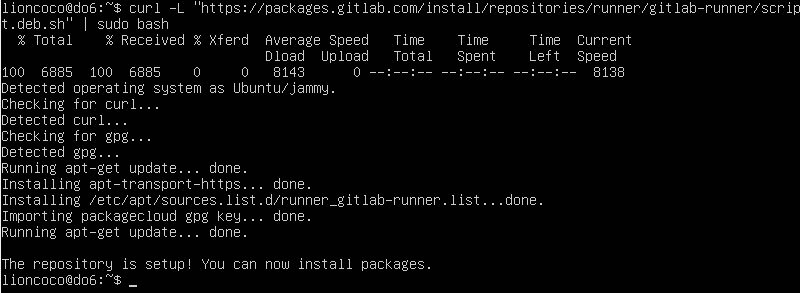
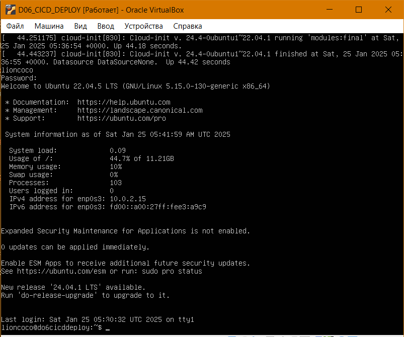
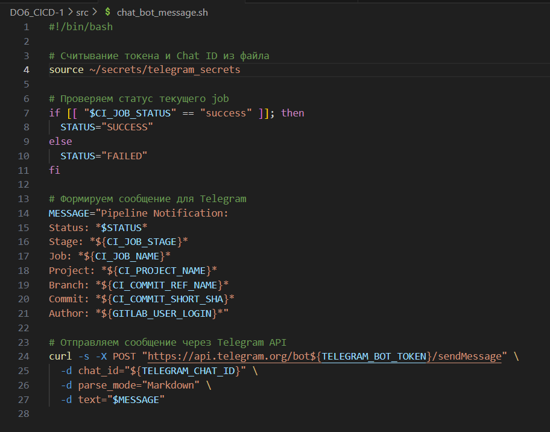

1. [Настройка gitlab-runner](#part-1-настройка-gitlab-runner)

2. [Part 2. Сборка](#part-2-сборка)

3. [Part 3. Тест кодстайла](#part-3-тест-кодстайла)

4. [Part 4. Интеграционные тесты](#part-4-интеграционные-тесты)

5. [Part 5. Этап деплоя](#part-5-этап-деплоя)

6. [Part 6. Дополнительно. Уведомления](#part-6-дополнительно-уведомления)


**При выполнения проекта использовались следующие ресурсы:**

[Get Ubuntu Server](https://ubuntu.com/download/server?ref=danielwertheim#architectures)

[Install GitLab Runner](https://docs.gitlab.com/runner/install/linux-repository.html)

[Registering runners](https://docs.gitlab.com/runner/register/)

[Шпаргалка по написанию Gitlab Pipelines](https://www.dmosk.ru/miniinstruktions.php?mini=gitlab-pipeline)

[GitLab CI/CD - Главные Основы создания CI/CD Pipeline](https://www.youtube.com/watch?v=R1a-1JYfiQA&list=PLg5SS_4L6LYuJxTrdU5vzBaVGlZko8Hsy)

## Part 1. Настройка gitlab-runner

**== Задание ==**

- [x] Подними виртуальную машину Ubuntu Server 22.04 LTS.

   

- [x] Скачай и установи на виртуальную машину gitlab-runner.

   

   ```bash
   # После добавления репозитория GitLab в список источников пакетов APT
   # Устанавливаем gitlab-runner
   sudo apt install gitlab-runner -y
   ```
- [x] Запусти gitlab-runner и зарегистрируй его для использования в текущем проекте (DO6_CICD).

  

## Part 2. Сборка

**== Задание ==**

- [x] Напиши этап для CI по сборке приложений из проекта `C2_SimpleBashUtils`.

- [x] В файле `gitlab-ci.yml` добавь этап запуска сборки через мейк файл из проекта C2.

- [x] Файлы, полученные после сборки (артефакты), сохрани в произвольную директорию со сроком хранения 30 дней.


## Part 3. Тест кодстайла

**== Задание ==**

- [x] Напиши этап для CI, который запускает скрипт кодстайла (clang-format).

- [x] Если кодстайл не прошел, то «зафейли» пайплайн.

- [x] В пайплайне отобрази вывод утилиты clang-format.


## Part 4. Интеграционные тесты

**== Задание ==**

- [x] Напиши этап для CI, который запустит интеграционные тесты.

- [x] Для проекта C2_SimpleBashUtils можешь взять свои уже написанные интеграционные тесты.

- [ ] Для проекта из папки code-samples напиши интеграционные тесты самостоятельно. Тесты могут быть написаны на любом языке (c, bash, python и т.д.) и должны вызывать собранное приложение для проверки его работоспособности на разных случаях.

- [x] Запусти этот этап автоматически только при условии, если сборка и тест кодстайла прошли успешно.

- [x] Если тесты не прошли, то «зафейли» пайплайн.

- [x] В пайплайне отобрази вывод, что интеграционные тесты успешно прошли / провалились.


## Part 5. Этап деплоя

**== Задание ==**

- [x] Подними вторую виртуальную машину `Ubuntu Server 22.04 LTS`.




- [x] Напиши этап для CD, который «разворачивает» проект на другой виртуальной машине.

- [x] Запусти этот этап вручную при условии, что все предыдущие этапы прошли успешно.

- [x] Напиши bash-скрипт, который при помощи ssh и scp копирует файлы, полученные после сборки (артефакты), в директорию /usr/local/bin второй виртуальной машины.

- [x] В файле gitlab-ci.yml добавь этап запуска написанного скрипта.

- [x] В случае ошибки «зафейли» пайплайн.

- [x] Сохрани дампы образов виртуальных машин.


## Part 6. Дополнительно. Уведомления

**== Задание ==**

- [x] Настрой уведомления об успешном/неуспешном выполнении пайплайна через бота с именем «[твой nickname] DO6 CI/CD» в Telegram.


>Chat ID
>В Telegram найди и начни чат с ботом `@userinfobot`.
>Отправь сообщение `/start`, и бот покажет твой Chat ID.

**На машине, где выполняется GitLab Runner, выполним следующие действия:**

```bash
# Перейдем к пользователю gitlab-runner
sudo -u gitlab-runner -i

# Создадим директорию
mkdir -p secrets

# В этой папке создадим файл telegram_secrets
nano /secrets/telegram_secrets

# Добавим туда следующие строки
TELEGRAM_BOT_TOKEN=ваш_токен_бота
TELEGRAM_CHAT_ID=ваш_чат_ID

# Установим права доступа, чтобы только пользователь gitlab-runner мог читать файл
chmod 600 /home/gitlab-runner/secrets/telegram_secrets

```




>Как видно сообщения приходят бот работает. Первый раз запустил без второй виртуальной машины и deploy завершился неудачей. После поднял виртуальную машину и перезапустил deploy.